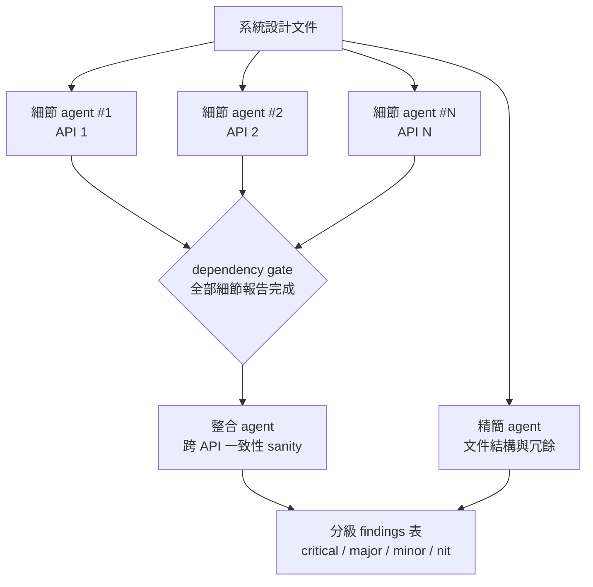

# 01 — Multi-agent 系統設計文件審查框架

> 角色：本框架由我設計與實作。

## English Abstract

I designed and implemented an evidence-driven multi-agent review workflow for system design documents containing multiple API changes. The workflow assigns one detail agent per API, gates a holistic integration review on completion of all detail reports, and runs a separate document-simplification review in parallel. Every finding must include a file-and-line anchor so downstream agents and human reviewers can verify it. The design addresses attention dilution, mixed review scopes, context cost, and unsupported AI conclusions.

## 問題

系統設計文件（SA/SD）動輒涵蓋十幾支 API 的變更，單一 LLM session 審查有兩個結構性問題：

1. **注意力稀釋**——文件塞進同一個 context，越後面的 API 審得越粗，遺漏率隨長度上升。
2. **視角混雜**——「單支 API 的欄位正確性」和「跨 API 的一致性」是兩種不同高度的問題，
   混在一個 prompt 裡兩邊都做不好。

## 範圍與非目標

這個框架負責「找出設計文件與實作證據之間的落差」，不是自動替團隊做設計決策。

| 項目 | 框架負責 | 框架不負責 |
|---|---|---|
| 文件審查 | API 規格、範例、欄位來源、跨 API 一致性 | 直接修改或發布文件 |
| 程式碼驗證 | 讀取既有 codebase，提供 file:line 證據 | 實作功能或執行 production 操作 |
| 結果整理 | 嚴重度分級、整合重複 finding、提出修正方向 | 代替技術負責人批准方案 |
| 文件品質 | 找出冗餘、歷史灰塵與結構問題 | 為了縮短而刪除必要決策脈絡 |

這個權責分界刻意保留 human-in-the-loop：AI 負責擴大檢查面與整理證據，人類保留套用、取捨與發布權。

## 拓撲：N+2 agent 依賴圖派工

每支 API 派一個「細節 agent」並行審查；一個「整合 agent」等全部細節報告完成後做跨 API 檢查；
一個「精簡 agent」與細節層並行，獨立負責文件本身的冗餘與結構問題。



## 輸入與輸出契約

### 輸入

- 系統設計文件：雲端文件連結或本機 Markdown；
- API 清單：由文件的 API Spec 段落辨識，也允許使用者覆寫 agent 數量；
- 驗證範圍：相關 repository、API path、method 與已知上下游；
- 執行依賴：指定的 agent 類型與文件／codebase 讀取能力。

### 輸出

每個 finding 使用固定資料契約，讓整合 agent 與人類都能直接消費：

| 欄位 | 用途 |
|---|---|
| Severity | `critical / major / minor / nit`，支援優先處理 |
| Scope | 指明是哪一支 API 或跨 API 問題 |
| Evidence | 精確的 `file:line` 或文件段落錨點 |
| Conclusion | 一句話描述已驗證的落差，不混入猜測 |
| Recommendation | 對下一版文件的修正方向，不直接代改 |

去識別化範例：

```text
[major] API B — response 欄位型別與實作不一致
Evidence: src/Domain/ExampleMapper.php:42
Conclusion: 文件宣告為 integer，實作在缺值時回傳 null。
Recommendation: 補上 nullable 契約，或在 mapper 統一輸出預設值。
```

這種格式的重點不是排版，而是把 finding 變成可驗證、可反駁、可追蹤的工程產物。

## 端到端執行流程

1. **Fail-fast 預檢**：確認 agent 與文件來源可用；缺少依賴就停止，不消耗後續 agent 預算。
2. **解析工作範圍**：從 API Spec 建立 API 清單與負責邊界，避免多個 detail agent 重複查同一件事。
3. **並行細節審查**：每支 API 一個 detail agent，逐項對照文件與 codebase。
4. **並行文件精簡審查**：另一個 agent 專注文件結構與冗餘，不與 correctness review 混在一起。
5. **Dependency gate**：只有全部 detail report 完成，整合 agent 才能啟動。
6. **整體一致性檢查**：找出各 API 單看正確、組合後卻矛盾的資料流與狀態問題。
7. **合併交付**：輸出分級 findings 與文件精簡清單，由文件 owner 決定是否套用。

## 關鍵設計決策

### 1. 整合層設 dependency gate，禁止與細節層並行

整合 agent 的輸入就是全部細節報告——提早啟動只會拿到殘缺視角、產出看似合理實則無據的結論。
這條規則來自實際踩雷後的固化：早期版本曾並行派工，整合報告引用了不存在的細節結論。

### 2. 強制 file:line 級證據鏈

每個 finding 必須附文件內的精確錨點。理由不是形式主義——**下游 agent 要消費這份報告**，
缺錨點的 finding 讓整合層無從驗證、只能照抄或丟棄。這是對 agent 之間資訊傳遞品質的工程化約束：
把「說得有道理」升級成「指得出出處」。

### 3. Prompt 範本外置、變數化填入

三種 agent 的派工 prompt 是版本化的範本檔，執行時填入變數（API 名、文件段落範圍、
下游消費者說明）。範本迭代不動流程碼，是 context engineering 的基本紀律。

### 4. Step 0 依賴預檢（fail-fast）

派工前檢查執行環境依賴是否齊備；缺件就引導安裝後結束，不讓 multi-agent 流程跑到一半炸掉——
派出去的 agent 是要花錢的。

### 5. 人機界線：預設不下場改文件

產出是分級 findings 表（critical / major / minor / nit），套用與否交還人類。
審查器和修改器是兩種權責，合併會讓人失去對文件的最終控制權。

### 6. 大文件分段策略

超過閾值（約 25K tokens）的文件先落地拆段，讓各 agent 只讀自己負責的段落，
而不是把全文塞給每個 agent——N 個 agent 各讀 1/N，總 token 成本反而低於單 agent 全讀。

### 7. 多 agent 共識不等於正確

實際 review 曾出現一個反直覺案例：5 個 agents 中有 3 個對同一份外部規格做出相同的錯誤解讀，
後續 verifier 也重複相同的 partial reading，給出最高信心。作者引用 primary source 反駁後，重新逐段閱讀才發現：
agents 都只讀到相同章節，忽略了另一種型別使用不同 response contract。

這表示 agents 的輸出不是天然獨立樣本；它們可能共享 prompt、搜尋結果與 partial-reading bias。
因此，涉及外部規格的高信心 finding 必須增加兩道控制：

1. 主 agent 直接讀 primary source，不能只採信 sub-agent 的摘要；
2. 作者提出文件證據反駁時，finding 必須重新開啟驗證，不用原本的 confidence score 壓過新證據。

## 可靠性控制

| 風險 | 控制方式 | Fail-safe 行為 |
|---|---|---|
| Agent 依賴未安裝 | Step 0 預檢 | 停止並提供安裝指引，不啟動半套流程 |
| Detail report 尚未完成 | Dependency gate | 整合 agent 不啟動，不以殘缺資訊產生 verdict |
| Finding 沒有證據 | Prompt 與輸出契約強制 evidence | 不進入可信 findings 清單 |
| 多個 agents 重複同一個誤讀 | 外部規格由主 agent 直接讀 primary source | Agent 共識只算相關證據，不當成獨立驗證 |
| 文件過長 | 內容落地後按 scope 分段讀取 | 避免全文廣播造成 token 放大與注意力稀釋 |
| Review 與修改權責混淆 | 預設唯讀、修改需另行授權 | 保留文件 owner 的最終控制權 |

## 衡量方式

目前能直接驗證的是流程拓撲、證據契約與失敗模式已固化在版本化 workflow 中。若要長期評估品質，應另外追蹤：

- **Evidence completeness**：具有效錨點的 findings 比例；
- **Review coverage**：完成 detail review 的 API 數／文件內 API 總數；
- **Accepted finding rate**：被文件 owner 接受的 findings 比例；
- **False-positive rate**：遭 codebase 證據推翻的 findings 比例；
- **Primary-source verification**：依賴外部規格的 findings 中，由主 agent 直接驗證的比例；
- **Context cost**：分段 multi-agent 與單一全文 review 的 token 差異；
- **Lead time**：從文件提交到可供人類決策的報告產出時間。

這些是建議的營運指標，不在沒有量測資料時宣稱虛構的改善百分比。

## 失敗模式清單（節選）

| 失誤 | 固化的規則 |
|---|---|
| 整合 agent 與細節 agent 並行派工 | dependency gate 寫進流程定義，非約定俗成 |
| finding 無錨點、下游無從驗證 | 證據鏈為必填欄位，缺件的 finding 直接退回 |
| 多個 agent 因閱讀同一局部章節而達成錯誤共識 | 高信心外部規格 finding 仍需 primary-source verification |
| 對超長文件全文廣播給所有 agent | 分段落地、各讀所需 |

## 這個案例證明的能力

- Multi-agent orchestration 與 dependency-aware workflow；
- Context engineering、prompt contract 與 progressive disclosure；
- 將 AI 輸出轉成可稽核 evidence chain；
- 在效率、完整性與 human ownership 之間做系統化取捨。
