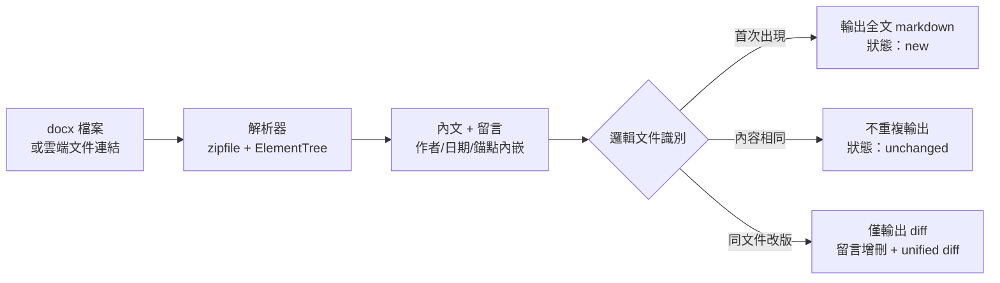

# 02 — Token 經濟的文件解析管線

> 角色：本管線由我設計與實作（約 448 行純 Python 標準庫，零第三方依賴）。

## English Abstract

I designed and implemented a dependency-free Python pipeline that extracts DOCX body text and anchored review comments, identifies successive versions of the same logical document, and returns one of three machine-readable states: `new`, `unchanged`, or `changed`. Repeated versions are handled with filename normalization, content fingerprints, persistent caching, and diff-only output. This turns document version management into context version management and avoids repeatedly sending an entire requirements document to an LLM.

## 問題

需求文件（PRD）在開發過程中多輪改版。每輪改版後把 40KB 的全文重新餵給 LLM，有三個代價：

1. Token 成本隨改版次數線性成長，但每輪真正的變更往往只有幾段；
2. 「這版改了什麼」靠人眼比對，遺漏變更等於實作走錯方向；
3. 文件裡的**留言**（reviewer 的意見與決策脈絡）在一般轉檔流程會全部丟失。

## 設計目標與限制條件

- **保留需求脈絡**：正文和留言必須一起被解析，留言要回到對應段落附近；
- **輸出可供 agent 分流**：呼叫端不用解析人類文字，直接根據結構化 status 決定下一步；
- **跨 session 記憶**：同一邏輯文件在不同時間解析，仍能辨識是否改版；
- **零安裝成本**：只使用 Python 標準庫，避免在開發機上增加 dependency 與供應鏈風險；
- **不假裝是完整文件轉換器**：表格和圖片不是這條管線的主要處理目標，遇到高版面依賴文件應改走專用工具。

## 設計



## 輸入與輸出契約

輸入可以是本機 `.docx`，也可以先由文件平台匯出為 `.docx`。解析器輸出 Markdown，並在 stdout 回傳結構化 JSON。

首次解析的去識別化範例：

```json
{
  "status": "new",
  "comments": 6,
  "size": 38214,
  "normalized_name": "checkout requirements",
  "output": "/workspace/checkout-requirements.md"
}
```

同一份文件改版後：

```json
{
  "status": "changed",
  "match_kind": "filename",
  "previous_source": "checkout-requirements.docx",
  "output": "/workspace/checkout-requirements-v2.md",
  "diff": "/workspace/checkout-requirements-v2.diff.md"
}
```

呼叫端只需要依 `status` 分流：

```text
new       → 讀完整 Markdown，建立初始需求脈絡
unchanged → 不重讀全文，沿用已知內容
changed   → 先讀小型 diff；只有問題無法回答時才回讀全文
error     → 依 error_kind 顯示可操作的修復方式
```

### 1. 純標準庫解析，保留留言

docx 本質是 zip 包裹的 XML。用 `zipfile + ElementTree` 直接解析內文與留言層，
把每則留言的作者、日期、錨定位置以參照標記內嵌回 markdown 對應段落。
不用通用轉檔流程的原因：評估過的方案會丟棄、或無法可靠保留留言——而留言正是需求討論中最有資訊量的部分。

### 2. 邏輯文件識別：檔名正規化 + 內容指紋

同一份文件的第 N 版，檔名可能是 `xxx(1).docx`、`xxx_v2.docx`、`xxx_final.docx`。
識別「這其實是同一份文件」採雙重機制：

- **檔名正規化**：剝除 `(1)`、版本號、日期、draft/final 等修飾成分後比對；
- **內容指紋 fallback**：檔名對不上時，以標題相同 + 前段內文相似度
  （`difflib.SequenceMatcher` ratio ≥ 0.7）判定。

刻意**不用 hash**：hash 只能回答「完全相同」，改版文件要的是「足夠相似」。

### 3. 三態輸出：new / unchanged / changed

- `new`——首次解析，輸出完整 markdown；
- `unchanged`——內容未變，直接指向既有產物，不重複消耗 token；
- `changed`——只輸出 diff 檔：留言的新增與刪除、內文的 unified diff。

**效果：改版後的重讀成本從 40KB 全文降為一份小 diff。**

### 4. 快取跨 session 生效

下載與解析產物固定落在同一目錄，讓「上週讀過這份文件」的判定不受 session 邊界影響。

### 5. 留言作為一等資料

解析器將留言作者、日期與錨點轉為 Markdown footnote。正文保留參照標記，留言內容集中在 Comments 區塊；因此 agent 既能沿著正文閱讀，也能精確回到 reviewer 的決策脈絡。

### 6. Structured error contract

流程不把 Python traceback 直接丟給上層 agent，而是將常見錯誤轉成穩定的 `error_kind`：

| error_kind | 代表問題 | 上層可採取的動作 |
|---|---|---|
| `file_not_found` | 輸入路徑不存在 | 要求確認路徑或重新下載 |
| `bad_zip` | 檔案不是有效的 DOCX／ZIP | 停止解析並要求重新匯出 |
| `missing_xml` | OOXML 結構缺件 | 告知文件可能損毀或格式不受支援 |
| `xml_parse` | 文件 XML 無法解析 | 保留原檔並回報解析層問題 |
| `unexpected` | 未分類錯誤 | 顯示類型與訊息，避免假裝成功 |

把錯誤也做成資料契約，才能讓 workflow 有一致的 fail-safe 行為。

## 與開發流程的組合

這條管線的真正價值在與需求討論流程的組合：PRD 每改版只餵 diff 給 LLM，
實作計畫跟著需求版本增量演進，不需要每輪改版重開 session 重建上下文——
文件版本管理變成了上下文版本管理。

## 取捨與已知限制

| 取捨 | 選擇理由 | 代價 |
|---|---|---|
| 使用標準庫直接讀 OOXML | 無第三方安裝、行為可控、能保留留言 | 需自行維護格式相容性 |
| 相似度閾值辨識邏輯文件 | 能識別改名後的同文件版本 | 極端情況可能誤配，需保留 match_kind 供檢查 |
| Unified diff 而非 semantic diff | 可重現、可稽核、無模型成本 | 無法自行理解段落搬移的語意 |
| 本機持久快取 | 跨 session 有效且不需外部服務 | 需考慮快取清除與裝置間不同步 |
| 聚焦正文與留言 | 滿足需求理解的主要資訊面 | 複雜表格、圖片與精細版面不保證完整還原 |

## 衡量方式

可從以下指標判斷管線是否真的降低成本，而不是只增加一層工具：

- 全文大小與 diff 大小的比率；
- `unchanged` 命中率與被省略的重讀次數；
- 邏輯文件誤配／漏配次數；
- 留言擷取完整率與錨點可定位率；
- 各 `error_kind` 發生分布及恢復成功率；
- 從文件改版到實作計畫同步完成的 lead time。

## 這個案例證明的能力

- Python 標準庫、OOXML、結構化錯誤與 deterministic pipeline；
- Token economics、cache design 與跨 session context management；
- 將文件處理能力封裝成可組合的 agent tool contract；
- 對 dependency、隱私、可重現性與維護成本做明確取捨。
