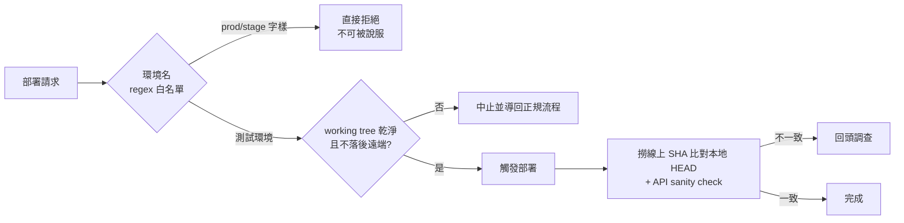
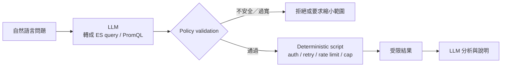

# 03 — AI 自動化安全護欄

> 角色：部署護欄與憑證治理由我設計與實作；production 查詢工具鏈為團隊共同建置，
> 文末「查詢治理」一節記錄其設計理念，以及我在線上事故調查中沉澱回饋的查詢規則。

## English Abstract

I designed and implemented deterministic guardrails around AI-assisted deployment and credential handling, and contributed operational query rules to a shared production-observability toolkit. The central principle is that authorization boundaries must live outside the model: environment allowlists, secret retrieval, repository-state checks, rate limits, result caps, and post-deployment verification are enforced by tools that cannot be overridden through conversation. The workflow fails closed when environment, credentials, source revision, or verification evidence is uncertain.

## 原則：權限邊界寫死在工具層，不依賴模型自律

給 AI 代理接上部署、查詢 production 的能力時，「請模型小心一點」不是安全機制。
護欄必須是 deterministic 的：規則寫在工具層，模型無法用任何對話說服它繞過。

## 威脅模型與信任邊界

這裡處理的不是「模型會不會故意作惡」，而是更常見的工程風險：模型可能誤解環境、組錯指令、重複查詢、把排隊成功誤判為部署成功，或將敏感資訊帶進 log。

| 資產／動作 | 主要風險 | 信任邊界 |
|---|---|---|
| 環境選擇 | 將測試部署誤送到正式環境 | 環境 allowlist 由 deterministic code 判定 |
| 原始碼版本 | 部署未提交、過期或錯誤 revision | Git 狀態與 remote 差異由指令驗證 |
| CI/CD token | 出現在 prompt、log 或 commit | 憑證只從 OS credential store 於執行期取用 |
| 部署結果 | 將「已排隊」誤報為「已上線」 | 線上 revision + API sanity check 雙重驗證 |
| Production query | 過大時間範圍、昂貴 wildcard、連續重試 | 腳本限制時間、size、rate 與 query pattern |
| PR approval | AI comment 被誤當成責任批准 | Comment 與 approve 權限分離，批准需要明文條件 |

模型可以提出意圖與查詢，但無法自行擴大權限；工具層是 policy enforcement point。

## 部署護欄

### 環境白名單（預設拒絕）

部署目標環境名必須符合測試環境命名的 regex 白名單（形如 `^sit-[0-9]+$`）；
任何含 prod / stage / uat 字樣的目標**直接拒絕**，規則明文標注「不可被說服」——
即使使用者在對話中堅持，工具層也不放行。生產部署永遠走人類的正式管道。

去識別化的決策表：

| 請求 | 結果 | 原因 |
|---|---|---|
| 部署到合法測試環境 | 進入 repository 狀態檢查 | 位於明確 allowlist |
| 部署到 production／stage／UAT | 拒絕 | 超出工具被授權的環境範圍 |
| 環境名稱模糊或無法解析 | 拒絕 | 不猜測高風險目標 |
| 使用者要求「略過檢查」 | 拒絕 | 對話不能覆寫工具層 policy |

### 前置狀態檢查

- working tree 有未提交變更 → 中止，導回正規 commit 流程（不自動代提交）；
- 本地落後遠端 → 強制停下處理，不部署過期程式碼。

這些檢查的目的，是讓部署輸入成為一個明確且可重現的 revision，而不是「開發者電腦現在大概長這樣」。

### 憑證治理

- 這條部署工作流使用的 token 僅存 macOS Keychain，執行期以系統指令取出，**明文永不落地**（不進檔案、log、commit）；
- 輸出時遮罩；
- 憑證失效的輪替流程文件化（更新同名 Keychain item 即可，工具不需改動）。

### Post-deploy 驗證：驗證優於宣稱

部署流程不以「build 已觸發（HTTP 201）」收尾——那只證明指令送出去了。收尾動作是：

1. 從線上 log 撈出實際部署的 commit SHA，與本地 HEAD 比對；
2. 對目標環境打一發 API sanity check 確認路由存活。

SHA 不一致就回頭查，而不是宣稱成功。



### 部署結果契約

工作流只允許三種對外狀態：

```text
rejected  → policy 或前置條件不通過，未觸發部署
queued    → CI/CD 已接受請求，但尚未宣稱服務可用
verified  → 線上 revision 與預期一致，且 sanity check 通過
```

這個狀態模型避免把 transport-level success 當成 service-level success。

## Production 查詢治理（團隊工具）

讓 LLM 查 production 的 log 與監控指標，職責分界是第一原則：

- **LLM 只負責語意轉換**——把自然語言問題轉成查詢語言（ES query / PromQL）；
- **腳本負責一切風險面**——認證、session 快取、401 重試、rate limiting、結果筆數上限。

查詢安全規則（防止 LLM 對 production 檢索系統亂射查詢）：

- 強制時間範圍 filter，超過一定範圍需明確確認；
- 禁止 leading wildcard 這類全索引掃描的查詢形態；
- 先以小 size 試查再放大；同一問題連續查詢設上限；
- 工具層 rate limiting（鎖檔實作的最小間隔）。

**實戰沉澱迴圈**：線上事故調查中踩到的查詢限制（例如尖峰流量分析時，過長的 rate window
會把 2–3 倍的瞬間峰值平滑掉；特定欄位的 tokenizer 會讓看似精確的比對誤匹配），
我會在事後把結論寫回規則庫——工具的查詢知識隨每次真實事故成長。

### 查詢結果本身也需要護欄

實際營運後，除了「查詢會不會傷害 production」，也必須防止「查詢安全但結論錯誤」：

| 失真來源 | 風險 | 治理方式 |
|---|---|---|
| Cooldown lock 拒絕平行查詢 | 上層把執行失敗誤判成零筆資料 | 多筆 query 序列執行，明確區分 `rate_limited / error / empty` |
| 只分析固定筆數 sample | 最近資料的分布可能與整段時間完全不同 | 探索用 sample；數量、比例與趨勢改用 server-side aggregation |
| 欄位 mapping／tokenizer 差異 | 看似精確的字串比對實際漏查或誤配 | 先探查 mapping，為已知欄位保存驗證過的 query pattern |
| 不同來源使用不同時區 | 事件 timeline 整體位移，導致錯誤 root cause | 每個 timestamp 保留 source timezone，統一轉換後再排序 |

尤其不能用 top-N sample 推論整體比例。Sample 適合檢查資料形狀；aggregation 才適合回答「多少、占比、隨時間如何變化」。

### 查詢分層



模型位於 policy 的兩側：前面負責語意轉換，後面負責解讀結果；中間真正碰 production 的部分由可預測的程式控制。

## AI 代理權限治理

自動化 code review 迴圈的權限設計（詳見 [04](04-code-review-loop.md)）：

- **預設永不自動 approve**——評論與批准是兩種權責；
- 開放 approve 需要**明文授權記錄**：授權範圍、前提條件（CI 全綠、明確的通過信號）白紙黑字，
  而不是口頭默契；
- 曾因 review 只看程式碼未查 CI 狀態被指正 → 先沉澱為跨 session operating rule；
  下一步仍應升級為 versioned workflow gate，避免只依賴 memory 是否成功載入（詳見 [05](05-memory-skill-governance.md)）。

## Fail-closed 行為

| 不確定狀態 | 行為 |
|---|---|
| 無法辨識目標環境 | 不部署 |
| 找不到憑證 | 不要求模型或使用者在對話中貼 secret；中止並引導設定 credential store |
| 本地與遠端 revision 關係不明 | 不部署，先恢復可驗證的 Git 狀態 |
| CI/CD 只回傳排隊成功 | 保留 queued，不宣稱 verified |
| 線上 SHA 不符 | 回到調查流程，不用 sanity success 掩蓋版本錯誤 |
| 查詢條件可能造成昂貴掃描 | 拒絕或縮小範圍後重試 |

## 範圍限制

這套護欄位於應用開發工作流層，不等同完整的雲端 IAM、Kubernetes admission policy、Terraform policy-as-code 或組織級 SIEM。它的價值是把 agent 最接近工程師日常操作的風險，轉成可版本化、可測試、預設拒絕的控制點；底層雲端與組織權限仍必須由既有平台安全機制負責。

## 衡量方式

後續可用以下指標評估護欄是否有效：

- 被 policy 擋下的越權／錯誤環境請求數；
- `queued → verified` 的成功率與驗證耗時；
- revision mismatch、sanity failure 的發生原因；
- secret 出現在 log／response 的事件數（目標必須為零）；
- production query 被限流、縮小時間範圍或拒絕的次數；
- query execution error 被正確區分、未誤報成空結果的比例；
- aggregation 結論與抽樣觀察不一致的次數，以及 timeline 時區修正次數；
- incident 後新增並版本化的防呆規則數量。

## 這個案例證明的能力

- DevSecOps、least privilege、deny-by-default 與 human authorization boundary；
- CI/CD verification、release safety 與 production troubleshooting；
- Observability query governance 與可靠性思維；
- 將事故經驗轉成 deterministic policy，而不是只寫提醒文字。
