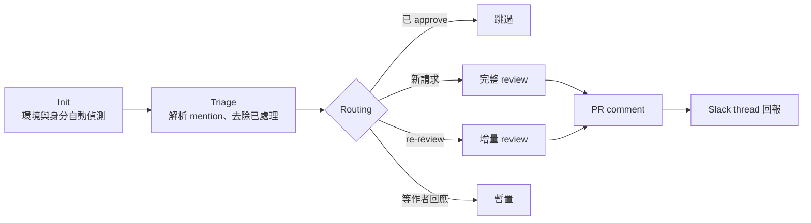
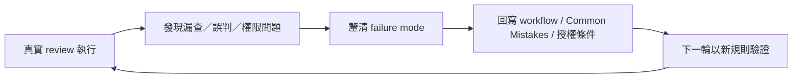

# 04 — Slack 驅動的自動化 Code Review 迴圈：架構與營運

> 角色聲明：本迴圈的六階段工作流本體（約 610 行流程定義）由團隊同事設計實作。
> 我負責它的**日常營運與治理**——排程機制、權限規則、跨人交接與持續改進——
> 本文從營運者視角記錄其架構，以及我負責的治理層設計。

## English Abstract

This case study describes how I operated and governed a teammate-built, Slack-driven automated code-review loop. The system discovers review requests in the team's existing communication channel, routes new reviews and incremental re-reviews, posts evidence-linked findings to the pull request, and returns status to the original Slack thread. My ownership covered scheduled operation, authorization rules, handover, failure-to-rule feedback, and team adoption. During a 30-day measurement window in June-July 2026, the loop recorded 41 executions.

## 這個迴圈做什麼

團隊成員在 Slack channel 發 PR review 請求（mention 目標 reviewer）；
迴圈自動撿起請求 → 完整 code review → 把結果 comment 回 PR → 回 Slack thread 通知。
在前置條件成立且不需人工裁決時，從請求到 review 結果回報不需要人工介入。

## 角色與責任邊界

| 層次 | 負責者 | 內容 |
|---|---|---|
| 六階段 workflow 核心實作 | 團隊同事 | Slack request routing、GitHub review、re-review 與結果回報 |
| 排程與日常營運 | 我 | 讓流程持續執行、追蹤卡住狀態、維持操作文件 |
| 權限與批准規則 | 我負責治理、團隊共同授權 | 定義何時只能 comment、何時可 approve，以及必要的 CI 前提 |
| 跨人交接與 onboarding | 我 | 降低工具綁定單一操作者的 bus factor |
| 持續改進 | 我與團隊 | 將真實失敗回寫成 workflow 規則 |

這份角色聲明刻意放在案例最前面：營運與治理是實際工程工作，但不應被包裝成自己撰寫了同事的核心實作。

## 六階段架構（走讀）



## 狀態機與 routing contract

每個 PR request 不只分成「做／不做」，而是依既有 review 與 commit 狀態路由：

| 狀態 | 判斷依據 | 動作 |
|---|---|---|
| Already approved | 已存在有效 approval | 跳過，避免重複消耗與干擾 |
| New request | 尚無本人先前 review | 執行完整 review |
| Re-review ready | 先前已 comment，之後有新 commit | 只檢查增量 diff 並核銷舊問題 |
| Waiting for author | 先前已 comment，但沒有新 commit | 暫置，不重複催促或重跑 |
| Tooling unavailable | Slack／GitHub 能力不可用或身分不明 | 明確失敗並要求修復依賴，不猜測身分 |

這使排程輪詢具備接近 idempotent 的行為：同一筆請求不會因為每次輪詢都重新 review。

架構上最值得記錄的四個設計：

### 1. 增量 re-review

作者修完再請 review 時，不重讀整個 PR：由上次 review 的時間點反推當時的 HEAD，
以 commit-range diff 只取增量變更，**逐條核銷**上輪 issue 的修復狀態（已修 / 未修 / 部分修），
新問題只在新 commit 範圍內找。省 token，也避免重複 raise 已處理的問題。

### 2. 大小 PR 分流 + 雙層驗證

大 PR 走完整多階段流程；小 PR 派輕量 sub-agent 快篩——但 sub-agent 被**明文限制唯讀**
（禁止寫入任何外部系統），且回報的高信心 issue 由主 agent **重讀 diff 二次驗證**後才輸出。
「AI 監督 AI」的雙層設計，擋掉 sub-agent 的 false positive。

### 3. 信心分數過濾

候選 issue 以 0–100 打分，僅回報高信心（≥80）項目。Review 工具的信任是資產：
狼來了三次，人就不看了。

### 4. API 呼叫預算

每個 PR 的外部 API 呼叫有明文預算（3–6 次），metadata 一次抓齊供全流程複用——
效率不是感覺，是寫下來的數字。

## 去識別化執行範例

```text
1. Slack 訊息：請 reviewer A 查看 PR #123
2. Triage：確認訊息確實 mention A，且 PR 尚未被 approve
3. Context：依 call budget 取得 PR head、變更量、檔案清單與既有 reviews
4. Routing：偵測為 re-review，只下載上次 review 後的 commit-range diff
5. Verification：逐條標記舊 finding 為 resolved / unresolved / partial
6. Output：新的高信心 finding 經主 agent 二次驗證後 comment 到 PR
7. Notification：原 Slack thread 回報完成狀態，讓作者收到通知
```

正式紀錄留在 PR，Slack 只承擔低摩擦觸發與即時通知；這避免重要 review 結論只存在聊天訊息裡。

## 我的治理層

### 排程與常態化營運

以排程輪詢機制驅動迴圈常態運行，**2026 年 6–7 月的一個 30 日統計區間內實際執行 41 次**——這不是 demo，
是長在團隊日常裡的流程。

41 次代表 adoption 與實際使用量，不等同「發現 41 個 bug」或「品質提升 41%」。我刻意不把執行次數包裝成效果指標；品質仍需搭配 findings 接受率、誤報率與 lead time 才能判斷。

### Approve 權限治理

- 迴圈預設**永不自動 approve**（評論歸自動化，批准歸人類）；
- 後續開放的 approve 能力有**正式授權記錄**：範圍、前提條件（CI 全綠 + 明確通過信號）文件化；
- 曾發生 review 只看程式碼、未查 CI 狀態的失誤，被指正後沉澱為
  「approve 前必查 CI」的跨 session operating rule——**錯誤 → 記憶 → 規則**的學習迴圈。

目前這項檢查仍依賴 operating memory；理想狀態是再升級成 versioned workflow gate，避免 memory 未載入時退化（詳見 [05](05-memory-skill-governance.md)）。

### CI-aware approval decision

CI 不是單一紅／綠布林值。批准前要把執行狀態與失敗來源一起判讀：

| CI 狀態 | 判讀 | Approval 行為 |
|---|---|---|
| 全部通過 | 再確認無 blocking finding 與授權條件 | 可依授權範圍 approve |
| 失敗且與本次 diff 有關 | 測試名稱、stack trace 或改動範圍能建立關聯 | 不 approve，列為 blocking issue |
| 疑似 infrastructure flake | 需有 job log、重跑結果或同 revision 的其他成功證據 | 明確揭露狀態後交由授權規則決定，不把紅燈說成綠燈 |
| CI 尚未完成／無法讀取 | Merge readiness 無法驗證 | Fail closed，不 approve |

這個判斷把 code correctness、CI health 與 authorization 拆成三個獨立條件；任何一項通過都不能替代另外兩項。

### 跨人交接

休假期間迴圈可交接給隊友觸發使用：工具身分、權限、操作方式皆文件化，
自動化不綁死在單一人身上——這是「個人工具」與「團隊流程」的分界線。

### 從失敗到規則

營運的核心工作不是每天盯著流程，而是讓同一種錯誤不要重複發生：



例如曾發生 review 結論只看程式碼、沒有先確認 CI；第一步先把「approve 前必查 CI」寫入跨 session operating rule，
下一步再提升成 versioned workflow gate。這個分層避免把「已經記住」誤寫成「工具已強制執行」。

## 可觀測性與營運指標

目前已留下的量化證據是指定 30 日區間內記錄 41 次執行。若要把工具長期當成內部服務營運，應追蹤：

- **Request volume**：每週 review／re-review 請求量；
- **Completion rate**：成功 comment 回 PR 並通知 Slack 的比例；
- **Lead time**：從 Slack request 到 review result 的時間；
- **Finding acceptance rate**：作者接受或修正的 finding 比例；
- **False-positive rate**：被主 agent 二次驗證或作者證據推翻的比例；
- **Re-review efficiency**：增量 diff 相對完整 PR 的檔案量／token 差異；
- **Human override rate**：需要人工接手、重跑或更正權限判斷的次數；
- **Coverage**：實際使用工具的團隊成員數，避免只有設計者自己使用。

這些指標應分開呈現使用量、可靠性與品質，不能用單一「執行次數」代替全部成效。

## 失敗處理與責任界線

| 失敗場景 | 處理方式 |
|---|---|
| Slack request 無法確定目標 reviewer | 不代選身分，要求明確 mention |
| GitHub 或 Slack tooling 不可用 | 顯示依賴錯誤，不假裝已完成 |
| PR 已由其他人 approve | 跳過，避免重複 review |
| 作者尚未推新 commit | 保持 waiting，不重跑同一份 diff |
| CI 未完成、無法讀取或與 diff 相關的失敗 | Fail closed，不 approve；回報可驗證的 CI 狀態 |
| Sub-agent 回報問題 | 主 agent 重讀 diff 驗證後才對外寫入 |
| Review comment 與 approval 權責衝突 | 預設 comment；approve 僅在文件化授權與前提成立時執行 |

## 非目標

- 不取代人類對架構方向、商業風險與 merge 決策的責任；
- 不用低信心建議填滿 PR，追求的是可信 signal 而非 comment 數；
- 不要求團隊改用新的入口，觸發點留在原本已使用的 Slack；
- 不把 agent 自述的「review 完成」視為證據，外部寫入與通知才構成可稽核結果。

## 營運心得

讓 AI 自動化真正長進團隊日常的三個條件，缺一不可：

1. **低摩擦觸發**——在團隊本來就在用的地方（Slack）發起，而不是要求人們改變習慣；
2. **可驗證的輸出**——每條 review 意見錨定到 diff 的具體位置，可以被作者反駁；
3. **明確權責**——工具能做什麼、不能做什麼、誰為結果負責，白紙黑字。

## 這個案例證明的能力

- 把一次性 AI 操作轉成可排程、可交接的團隊服務；
- AI workflow governance、權限邊界與 audit trail；
- Incremental processing、成本預算與 false-positive control；
- 以實際運作回饋持續改善流程，而非停留在 demo。
