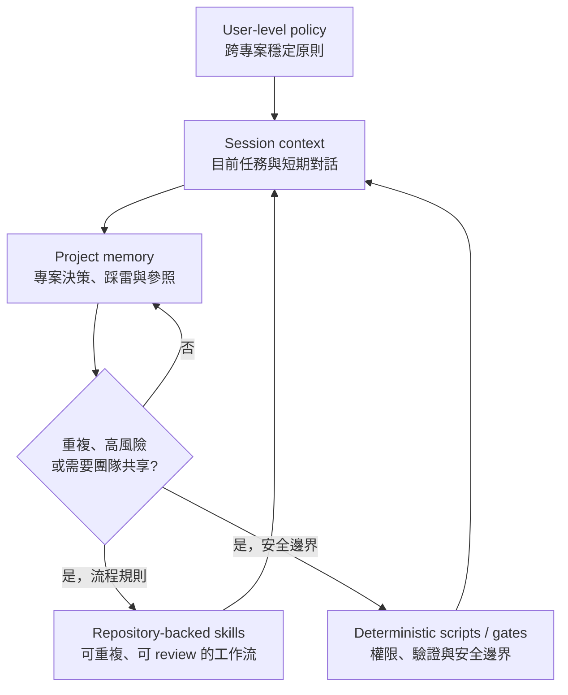
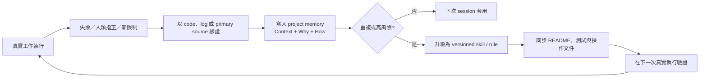

# 05 — AI Engineering Memory & Skill Governance

> 角色：我使用 Claude Code 提供的 user instructions 與 project memory 能力，設計並營運分層工作脈絡；
> 將反覆出現的工程問題升級為 repository-backed skills 與規則。底層 memory engine 為 Claude Code 平台能力，並非由我實作。

## English Abstract

I established and operated a layered AI working context using Claude Code's user instructions, project-scoped memory, and repository-backed skills. Stable cross-project policies live at user scope; project-specific decisions and failure lessons stay close to their relevant codebase; recurring or high-risk patterns are promoted into version-controlled workflows or deterministic checks. This case study explains the promotion criteria, trust boundaries, stale-memory risks, and feedback loop that turn isolated AI sessions into an auditable engineering practice without claiming ownership of Claude Code's underlying memory engine.

## 問題：Session 會結束，但工程責任不會

單次 AI session 可以完成任務，卻不會自然形成組織能力。若沒有治理，常見問題包括：

- 同一個錯誤在不同 session 重複發生；
- 專案規則混進全域指令，造成不相關工作被錯誤套用；
- 對話中做出的決策沒有版本、無法追蹤為何存在；
- 舊記憶與新流程衝突，agent 讀到過期規則仍照做；
- 把 token、內部連結或個人資訊直接寫進 memory，擴大敏感資訊暴露面；
- 只有「記得要小心」，但高風險行為沒有 deterministic gate。

目標不是讓 AI 記住一切，而是讓不同生命週期、不同風險的知識進入正確層級。

## 實際運作範圍與歸屬

2026 年 8 月的唯讀盤點顯示，這套工作環境包含一份 user-level policy，以及分布於 9 個 workspace 的 project-scoped memory。這個數字證明的是長期、多專案使用範圍，不代表所有 memory 都是人工撰寫，也不等同工程成效。

我的工作包括：

- 定義哪些規則放在 global、project memory、versioned skill 或 deterministic script；
- 維護 user-scoped skills 與 Git repository 之間的 single source of truth；
- 將人類指正、事故調查與工具失敗整理成 `Context / Why / How to apply`；
- 對反覆出現或高風險問題進行「memory → skill／code」升級；
- 盤點過期與互相矛盾的記憶，避免把 auto-memory 當成永遠正確的事實庫。

我沒有設計 Claude Code 的 memory engine，也不把平台自動保存的 memory 數量宣稱成個人產出。

## 分層架構

| 層級 | 適合內容 | 不應放入 |
|---|---|---|
| Session context | 當次目標、暫時假設、未定案討論 | 長期唯一真相 |
| User-level policy | 語言、安全、授權、跨專案一致原則 | 單一服務的欄位或部署參數 |
| Project memory | 專案決策、已驗證踩雷、工具使用差異 | Secret、客戶資料、無期限的臨時狀態 |
| Versioned skill | 可重複流程、輸入輸出契約、Common Mistakes | 只發生一次且高度情境化的筆記 |
| Deterministic gate | 認證、allowlist、CI 狀態、revision 與結果驗證 | 交給模型自行判斷的權限邊界 |

## 從回饋到規則的升級迴圈

升級判斷不是看內容寫得多不多，而是看失敗成本：

- **一次性、低風險**：留在 project memory，附適用範圍與證據；
- **反覆出現、多人會遇到**：升級為 Git 版控的 skill／Common Mistakes；
- **涉及部署、批准、憑證或資料修改**：不能只靠 memory，必須再升級成 deterministic check 或明文授權 gate；
- **工具已退役或決策已改變**：標示 superseded，並反向清查引用它的 memory 與文件。

## 去識別化的實際升級案例

| 原始訊號 | 驗證後的教訓 | 應落在哪一層 |
|---|---|---|
| 多個 review agents 對同一外部規格得出一致但錯誤的結論 | Agent 共識可能只是共享同一種 partial-reading bias；涉及外部規格要直接重讀 primary source | Project memory → review skill verification rule |
| Code review 判斷正確，卻漏看 CI | Code correctness 與 merge readiness 是兩個判斷；批准前要檢查 CI 並分類 code failure／infra flake | Operating memory → versioned approval gate |
| 平行查詢碰到 cooldown lock | Tool failure 不能被解讀成零筆結果；查詢需序列化並區分 `rate_limited` 與 `empty` | Project memory → query wrapper contract |
| CLI 被 shell wrapper 攔截，指令實際沒有執行 | Exit/output 不是唯一完成證據；設定變更後要讀回狀態驗證 postcondition | User memory → tool invocation rule |
| Code-indexing 工具效益低於索引成本，替代工具又不符合商用授權 | AI 工具選型同時受效能、維護與 license 約束；退役後回到簡單可控的 code search | Global policy + deprecation record |

這些案例的共同點是：不把「下次記得」當成修復，而是選擇能承受該風險的最小治理層。

## Repository-backed skill 的 single source of truth

User-scoped skill directory 與團隊 Git repository 使用同一份檔案來源，讓本機執行能力與可 review 的版本歷史保持一致。Skill 新增、刪除、重新命名或用途改變時，README 的目錄與能力表必須在同一次變更中同步。

這個安排帶來三個效果：

1. **本機生效與版本控制一致**：不會出現「電腦上能跑，repository 裡找不到」的漂移；
2. **變更可審查**：workflow、script 與文件可以一起看 diff；
3. **團隊可交接**：個人 prompt 被提升成有結構、觸發描述與操作邊界的共享資產。

但 Git 版控不會自動保證內容正確；skill 仍需要實際執行、failure review 與文件同步。

## 對外公開與下一階段資料邊界

| 資料 | 處理方式 |
|---|---|
| Token／password／session cookie | 公開文件不包含；工作流應只記錄安全取得方式，credential 留在安全儲存區 |
| 內部 domain、channel、ticket 與人員資訊 | 僅留在受控環境的 project reference，不進公開作品集 |
| 工程規則 | 去識別化後可提升成 global policy 或公開架構案例 |
| 尚未驗證的推論 | 留在 session，不提升為長期 memory |
| 人類授權 | 記錄範圍、期限與前置條件；不得由模型自行擴張 |

公開文件只展示架構模式與工程取捨，不匯出原始 memory，也不公開其內部參照。原始 user／project context
包含受控的內部參照，因此下一階段仍應進行定期 sanitization audit，將「只保存取得方式、不保存 credential value」變成強制規則。

## 已發現的限制：Stale memory 與 precedence

實際盤點發現，較舊的 project memory 仍建議使用一個已被較新 global policy 退役的工具。這說明「有記憶」不等於「記憶一致」；若 agent 同時讀到兩份規則，仍可能選錯。

目前可依「較新、範圍更明確、風險更保守」原則人工判斷，但這不是理想的長期控制。下一階段應加入：

- `status: active / superseded`；
- `last_verified` 與 owner；
- 明確 precedence：deterministic policy > versioned skill > global policy > project reference > session inference；
- 定期 conflict／staleness audit；
- 工具退役時反向搜尋並更新所有引用。

以上是已識別的改善方向，不宣稱目前已完全自動化。

## 衡量方式

要評估記憶治理是否有效，可分開追蹤：

- **Reuse**：既有 memory／skill 在後續任務中被正確套用的次數；
- **Repeat failure rate**：相同 failure mode 再次發生的比例；
- **Promotion lead time**：從人類指正到進入 versioned rule 的時間；
- **Staleness**：超過驗證期限或引用已退役工具的 memory 比例；
- **Conflict count**：global、project 與 skill 之間互相矛盾的規則數；
- **Documentation drift**：skill 內容與 README／操作文件不一致的項目數；
- **Secret exposure**：敏感資訊進入 memory、log 或 repository 的事件數，目標為零。

目前能直接證明的是分層配置、多 workspace 的實際運作，以及多個 failure-to-rule 案例；在沒有持續量測前，不宣稱虛構的效率或品質提升百分比。

## 這個案例證明的能力

- AI-native workflow configuration 與跨 session context engineering；
- Agent Skills、repository-backed governance 與文件同步；
- 將人類回饋轉成可重用規則，同時保留 ownership 與證據邊界；
- 能辨識 auto-memory 的 staleness、conflict 與 secret exposure 風險；
- 在平台能力、LLM reasoning 與 deterministic enforcement 之間建立清楚分工。
